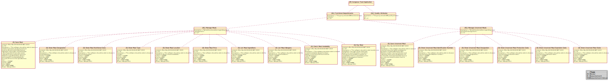

# EDOM - Project Increment 1

In this folder you should add **all** artifacts developed for the project increment 1.

**Note:** If for some reason you need to bypass these guidelines please ask for directions with your teacher and **always** state the exceptions in your commits and issues in bitbucket.

## Requirements Metamodel Validations

For this metamodel, the following validations were proposed and implemented using OCL:

**Model** model

|Validation|Explanation|
|----------|-----------|
|Must have a title|A title identifies the model, so it is required for a model to have one|
|Title length must greater or equal than three (3)|This validation is imposed as a model represents a project. Projects are normally named with acronyms which length varies between [3, 10[|
|||

**Requirement Group** model

|Validation|Explanation|
|----------|-----------|
|Must have a name|A name identifies the group of requirements, so it is required for a requirement group to have one|
|Name length must greater or equal than five (5)|This validation is imposed as a way to promote better identification of groups (e.g. FR is less identifiable than Functional Requirements)|
|Must have a description|This validation grants that a requirement group is described|
|Description length must be greater or equal than ten (10)|This validation is imposed in order to promote higher quality of group descriptions|
|Cannot have Sub Requirements Group with same name|As a name identifies a group of requirements, it does not make sense to aggregate requirement groups which have the same identification|
|||

**Requirement** model

|Validation|Explanation|
|----------|-----------|
|Must have a title|A title identifies a requirement, so it is required for a requirement to have one|
|Title length must greater or equal than five (5)|This validation is imposed as a way to promote better identification of requirements (e.g. SMD is less identifiable than Show Meal Designation)|
|Must have a description|This validation grants that a requirement is described|
|Description length must be greater or equal than ten (10)|This validation is imposed in order to promote higher quality of requirements descriptions|
|State cannot be resolved if resolution is invalid|It is not possible for a requirement to be resolved/done if its resolution is invalid|
|State cannot be approved if resolution is invalid|It is not possible for a requirement to be approved if its resolution is invalid|
|State cannot be reviewed if resolution is invalid|It is not possible for a requirement to be reviewed/verified if its resolution is invalid|
|Must have a creation date|A requirement requires a creation date to be established|
|Must have an author|A requirement is created by an individual so its identification needs to be established|
|Author length must be greater or equal than three (3)|This is imposed in order to promote better identification of authors|
|||

**Version** model

|Validation|Explanation|
|----------|-----------|
|Major cannot be lower than zero (0)|This is imposed as to grant that version major numbers are not negative|
|Minr cannot be lower than zero (0)|This is imposed as to grant that version minor numbers are not negative|
|Service cannot be lower than zero (0)|This is imposed as to grant that version service numbers are not negative|
|||

**Comment** model

|Validation|Explanation|
|----------|-----------|
|Must have an author|A comment is made by an individual so its identification needs to be established|
|Author length must be greater or equal than three (3)|This is imposed in order to promote better identification of authors|
|Must have a body|This validation grants that a comment is described|
|Body length must be greater or equal than fifteen (15)|This validation is imposed in order to promote higher quality of comments|
|Must have a subject|A subject identifies a comment, so it is required for a comment to have one|
|Subject length must be greater or equal than ten (10)|This validation is imposed in order to promote better identification of comments|
|Must have a creation date|A comment requires a creation date to be established|
|||

## Representations for Requirements Diagram

For the requirements metamodel two possible diagram representations using *[Plant UML](http://plantuml.com/)* were studied and implemented.

The first representation is very similar to the one used to represent the mindmap metamodel, which uses **Graphviz**. This representation represents each model using circles, and connects each one of the models using an arrow, as seen in **Figure 1**.

<i>Figure 1 - Gorgeous Food Application requirements visualization using Graphviz</i>

Even though this representation displays all requirements models, it lacks support in differentiating models and their properties. For example, an individual which does not know anything about the *Gorgeous Food Application* wouldn't properly recognize that *Manage Meals* and *Manage Unserved Meals* were two different **requirement groups**. This recognition is also affected due to models properties not being represented in the diagram.

In order to improve the lack of comprehension in requirements metamodel, an alternative diagram representation was implemented using an [*object diagram*](http://plantuml.com/object-diagram) as seen in **Figure 2**.

In this representation it is now possible to identify each model property as models are now UML objects. Also, the recognition of requirements models is now more clear as the initials of each model are explicit in object headers.