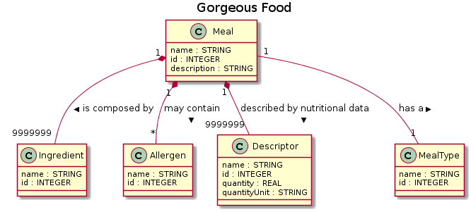

## Repository with Eclipse Projects for EDOM Integration Project

Each team should download a copy of this repository and copy it inside their repository.

This is a Maven/Eclipse Multi-module project. The pom.xml file in the base folder includes all other projects as sub-modules.

You should create an empty Eclipse workspace.

You should then use **File/Import.../Existing Maven Projects** and select the base folder of this repository. This will import/open all the projects.

Note: The projects were created with **Eclipse Oxygen**. You should use **Eclipse Oxygen**!

You can build all the projects using Maven by executing **mvn clean install** in the base folder of the repository.

### Domain Engineering

This repository contains projects relating to 5 metamodels and their respective supporting projects:

  - the Metamodel project (pt.isep.edom.project.c?.mm.\*)
  - the DSL project (pt.isep.edom.project.c?.dsl.\*)
  - the ATL project (pt.isep.edom.project.c?.atl.\*)
  - the Acceleo project pt.isep.edom.project.c?.mtl.\*)

The metamodels/dsl are as follow:

  - **usecase**
  - **nav**
  - **rest**
  - **domain**
  - **dbase**  

### Application Engineering

There is also one project that uses the other projects to build an application, the **Gorgeous Food App**.

This project is named **pt.isep.edom.project.gorgeousfood**

This project can be imported and used in the **base** Eclipse (where all other projects are open) but its aim is to be imported and used in a second instance of Eclipse (that will have all the previous plugins active).  

## Technical Report

### Component 3 (Domain Model)

#### Metamodel OCL Validations

In order to grant that the domain rules of domain metamodel are complied, the following OCL invariants have been added in order to validate the domain models

**Domain Model** model

|Validation|Explanation|
|----------|-----------|
|Name cannot be null|The name field identifies the domain model domain, so it is required the existence of one|
|Name length must be equal or greater than 3|This validation is imposed as a domain model represents a domain|
|Must have at least one entity|If a domain is being addressed then at least one concept must exist|
|Cannot have entities that do not have any reference to other entities (not referencing or not being referenced)|All domain concepts are linked to each other in some way, if not then the concept purpose is redudant|
|Cannot have more than one entity with the same name|Domain concepts cannot be identified with the same name|
|||

**Entity** model

|Validation|Explanation|
|----------|-----------|
|Name cannot be null|The name field identifies the entity, so it is required the existence of one|
|Name length must be equal or greater than 3|This validation is imposed as a domain model represents a domain|
|Name can only contain alpha numeric characters and spaces|A domain concept can only be identified with the abecedarium letters and numbers using spaces|
|Must have at least id (int) and name (string) fields|As stated in the assignment, there should always exist at least two fields that identify an entity|
|Cannot have duplicated fields (field with the same name)|It doesn't make sense the existence of more than one field with the same name as a field has a purpose|
|Cannot have a subentity that references the entity that contains the subentity|Entities cannot contain themselves (yet they can reference themselves)|
|||

**Field** model

|Validation|Explanation|
|----------|-----------|
|Name cannot be null|The name field identifies the field, so it is required the existence of one|
|Name can only contain alpha characters|In the developers opinion, a field that is identified by other characters than alpha, create redudancy in the field identification|
|||

**Sub Entity** model

|Validation|Explanation|
|----------|-----------|
|Name cannot be null|The name field identifies a containment relationship. This validation is proposed in order to impose the identification of relationships|
|Upper bound value must be equal or greater or equal than -1|The upper bound inferior limit is -1 (Zero or Infinite)|
|Entity reference cannot be null|If a relationship exists than the target entity must exist|
|||

**Reference** model

|Validation|Explanation|
|----------|-----------|
|Name cannot be null|The name field identifies a association relationship. This validation is proposed in order to impose the identification of relationships|
|Upper bound value must be equal or greater or equal than -1|The upper bound inferior limit is -1 (Zero or Infinite)|
|Entity reference cannot be null|If a relationship exists than the target entity must exist|
|||

### Diagrams

In order to visualy comprehend a domain model, a UML class diagram was conceived in order to represents the entities, its fields and relationships. To do this java code that translates a domain model into a PlantUML file was implemented.

An example of this diagram can be found in the Figure below.

### ATL Transformation

In order to transform a Use Cases Model in a Domain Model, a set of ATL transformations were implemented, as seen below:

- An UseCaseModel should result in a DomainModel
- Each UseCase with comment CRUD and entity should result in an Entity (Entity Use Case)
- Each UseCase with comment CRUD and local entity that includes an Entity Use Case should result in a SubEntity
- Each Entity Use Case that extends other Entity Use Case should result in a reference - between Entities
- Comments that are identified as “Upper Bound: X” identify the upper bound of a SubEntity or Reference, where X is the bound value
- Comments that are identified as “Field: X | Y” identify a field of an Entity, where X is the name of the field and Y its type

These transformations required the change of Use Cases metamodel and DSL in order to add the concept of a `Comment`. Each of these comments allowed to identify if a Use Case was an entity or an entity that was contained by another entity. Although that it wasn't required, comments were also used to identify the fields of entities. In order to allow the identification of relationships upper bound values, it was also comments on `Relationship` models.

### Code Generation

Similary to `Increment 4`, Acceleo code was also used to generate Java Code that represent the domain model. The following table represent the generated code:

|Interface|Description|
|---------|-----------|
|Entity|Allows to mark that a concretization is an entity of a use case, and specifies that an entity allows the access of its name and identifier by defining `name` and `id` methods|
|DTO|Allows the mark of a concretization that represents entities information messaging as a plain object|

Additionaly other interfaces were defined that produce the behavior of design patterns, being these:

|Interface|Description|
|---------|-----------|
|Factory|Produces functionalities that allow the creation of entities|

The following tables summarizes the transformations that were taken in account:

|Template Signature|Description|
|------------------|-----------|
|`generateDomainModel`|The entrypoint for the generation of the code. Generates an empty class to mark the domain model|
|`generateFactoryInterface`|Generates a file that describes an interface for the `Factory` design pattern|
|`generateFactoryImpl`|Generates a file that represents an implementation class of the factory interface|
|`generateFactorySingleton`|Generates a file that represents a class that acts as a singleton of the factory interface|
|`generateRepositoryInterface`|Generates a file that describes an interface for the `Repository` pattern|
|`generateEntityInterface`|Generates a file that describes the entity interface|
|`generateDTOInterface`|Generates a file that describes the DTO interface|
|`generateSpecificEntityInterface`|Generates a file that describes an interface of a specific entity (e.g. Meal)|
|`generateSpecificEntityInterfaceImpl`|Generates a file that describes a concrete class implementation of an entity|
|`generateSpecificEntityDTO`|Generates a file that describes a concrete class implementation of an entity DTO (e.g. MealDTO)|

### Component 4 (Persistence)

#### Metamodel OCL Validations

To validate the models of persistence component, the following OCL invariants have been added.

**DbaseModel**

|Validation|Explanation|
|----------|-----------|
|Must have name |The name identifies the dbase model, so cannot be undefined|
|Name must be unique|This validation have been added to grant that don't exists dbase models with the same name |
|Must have at least one table|A dbase model cannot be exist without the existence of at least one table|

**Table**

|Validation|Explanation|
|----------|-----------|
|Must have name |The name identifies the table, so cannot be undefined|
|Must have entity |The entity cannot be undefined|
|Name must be unique|This validation have been added to grant that don't exists tables with the same name because the name identifies the table |
|Must have at least one column|A table cannot be exist without the existence of at least one column|

**Column**

|Validation|Explanation|
|----------|-----------|
|Must have name |The name identifies the column, so cannot be undefined|
|Must have type |The type cannot be undefined. Its a very important property in a column|
|Name must be unique|This validation have been added to grant that don't exists columns with the same name because the name identifies the column |

### ATL Transformation

To transform a Use Cases Model in a Dbase Model, the follow ATL transformations were implemented:

- An UseCaseModel should result in a DbaseModel
- Each UseCase with comments CRUD and entity or local entity should result in a Table with one column for its key

To do this, when a table is created, a column is also created, which will be the key of the table.

### Code Generation

To represent the dbase model with Java Code, first created a class that allows connection to the database using JDBC driver and that allows the creation of tables in the database.

After that, a class was created for each table in the dbase model. These classes have functions that allow CRUD operations on the corresponding tables:
- There is a function that allows to get the row with the corresponding id
- There is a function that removes the row of the table with the corresponding id
- There is a function that inserts a new row in the table
- There is a function that updates a row in the table with the corresponding id
- There is also a function that allows to get all rows in the table