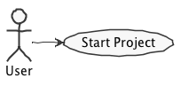

# EDOM Repository

The goal of this repository is to serve as a template for the project developed during the EDOM course of the MEI Master Program, edition 2018/19.

** Please follow the instructions of the teachers of your course because they will always prevail over what is stated in this readme file. **

## Students Individual Folders
Each member of the team should have his specific subfolder. Inside this folder there should be one subfolder for each project increment.

You will encounter some already existing folders that follow these guidelines. You may rename them to better identification. For instance if the team has 3 members named Manuel, Paulo and Maria you may rename student1 to manuel, student2 to paulo and student3 to maria and remove all unused folders.

**Note:** If for some reason you need to bypass these guidelines please ask for directions with your teacher and **always** state the exceptions in your commits and issues in bitbucket.

## Documentation
It is mandatory that you produce documentation for all your tasks. The documentaion **must** always be produced in these readme.md files!

These readme.md files use markdown. You may find further documentation about markdown in [Markdown](https://en.wikipedia.org/wiki/Markdown)

### Producing Technical Diagrams

This repository supports the generation of PlantUML diagrams using Gradle.

The PlantUML diagram files must be included in the **puml** folder. The file build.gradle and the folder buildSrc are where the gradle support for PlantUML is located.

To generate diagram simple execute "gradle" in a terminal (having the root of the project as the current folder).

The repository includes an example of a PlantUML diagram in puml/usecase.puml.

## Issues and Commits

Each team will usually have a clone of this repository in bitbucket.

It is a good practice to create an **Issue** in bitbucket for each task that your team or you individually will be developing.

Each commit in your repository should always make a reference to the corresponding issue. For instance, in the previous example, if the issue created has an id 10, then in the commit message you should make a ref to that issue. Example: "Increment 3 - Added class model diagram, ref #10".

You should also close the issue when the task is finished.

For each deadline/submission of your task/project you should also create a tag in the repository.

## Links

This is a very simple example on how to create a table with links to several pages of the repository.

| Title                       | Link 							  |
|-------------------------------------|------------------------------------|
| Manuel					                   |[Manuel](student1/) |
| Paulo					                   |[Paulo](student2/) |
| Maria					                   |[Maria](student3/) |
| Research Topic					                   |[Research](project-research-topic/) |
