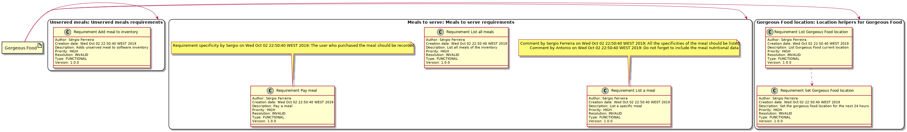

# EDOM - Project Increment 1

## List of validations to the requirements metamodel

### Model

|  Validation                            |  Justification                                                                      |
|----------------------------------------|-------------------------------------------------------------------------------------|
|  Title must exist                      |   A model should have a title identify it among its peers                           |
|  Title must have at least 5 characters | In order to have a readable title for a model it should be at least five characters |

### RequirementGroup

|  Validation                                  |  Justification                                                                                     |
|----------------------------------------------|----------------------------------------------------------------------------------------------------|
|  ID must exist                               | RequirementGroup should have an ID to identify it among its peers                                  |
|  ID must be unique                           | The ID should be unique to identify among its peers                                                |
| Name must exist                              | RequirementGroup should have a name to represent clearly in few words what this group is meant for |
| Name must have at least 5 characters         | Name should be at least five characters for a good representation                                  |
| Description must exist                       | Should have a description to have an overview of this group                                        |
| Description must have at least 10 characters | Should have at least 10 characters to express clearly the group                                    |

### Requirement

|  Validation                                                               |  Justification                                                                                                                                         |
|---------------------------------------------------------------------------|--------------------------------------------------------------------------------------------------------------------------------------------------------|
|  ID must exist                                                            | Should have an ID to identify it among its peers                                                                                                       |
| ID must be unique                                                         | The ID should be unique to identify among its peers                                                                                                    |
|  Title must exist                                                         | Requirement must have a title to identify what the requirement is about                                                                                |
| Ttile must have at least 5 characters                                     | Title must be at least 5 characters to be meaningful                                                                                                   |
| Description must exist                                                    | Must have a description to describe what the requirement is about                                                                                      |
| Description must have at least 10 characters                              | Must have at least 10 characters to be a meaningful description                                                                                        |
| Created date must exist                                                   | Must have a creation date to identify if the requirement is still valid. Perhaps some business rules changed and the requirement no longer makes sense |
| Comments must be created on same date or after requirements creation date | It does not make sense to comment a requirement before it was created                                                                                  |

### Comment

|  Validation                             |  Justification                                                                                                                                  |
|-----------------------------------------|-------------------------------------------------------------------------------------------------------------------------------------------------|
|  Subject must exist                     | Subject must exist so someone who reads the comment knows exactly what is is about                                                              |
| Subject must have at least 5 characters | Must be at least five characters to be meaningful                                                                                               |
| Body must exist                         | Comment must have body to express what the comment is about                                                                                     |
| Body must have at least 5 characters    | Body must be at least five characters to be meaningful                                                                                          |
| Author must exist                       | Author must exist so anyone who wants to discuss a comment to a requirement knows who he/she should talk to                                     |
| Created Date must exist                 | Created date must exist to know if the comment is recent or not. Perhaps a comment which was made before a business change is not valid anymore |

## Diagram of the created requirement instance

## Alternative diagram of the created requirement instance

## Analyze possible problems in the coding of the generation of the diagram

This coding is hard coded. It is writing to a text file the plant UML specification. This makes the code much less readable
and if at any time there is an update on the plant UML API that invalidates any kind of syntax the generation code might break.
This can be solved by creating a facade for the plant UML artifacts and separating that facade to a different project.